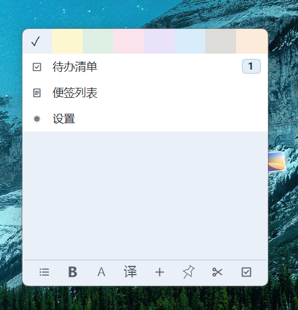
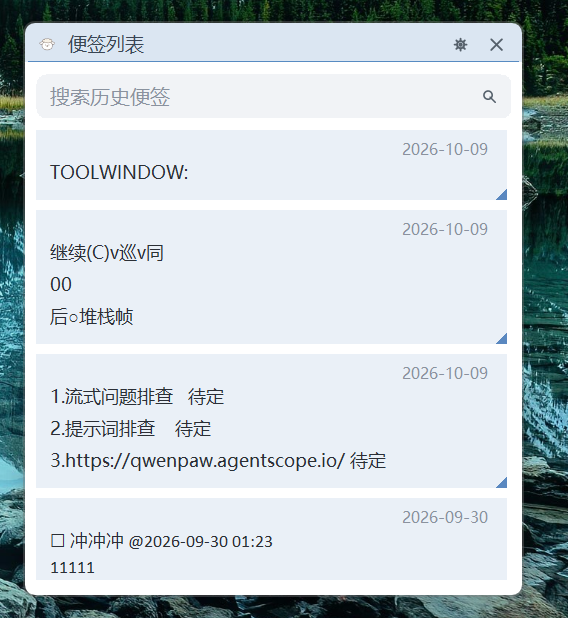
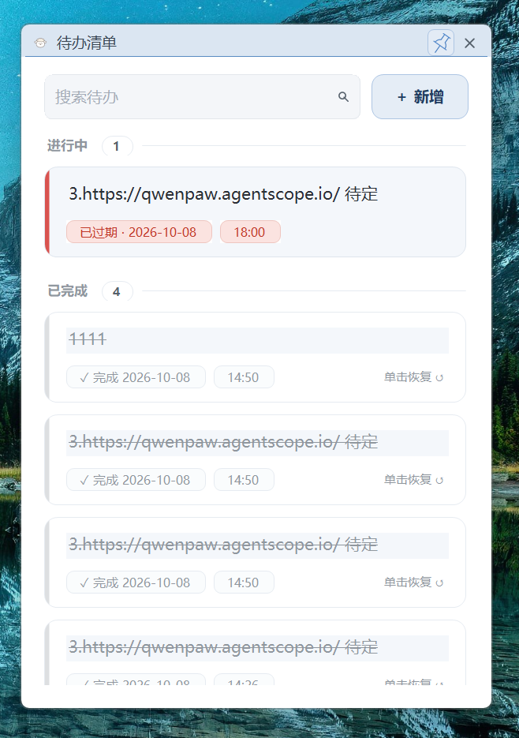
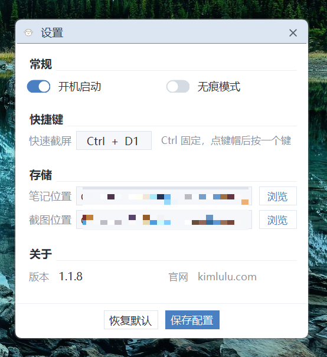
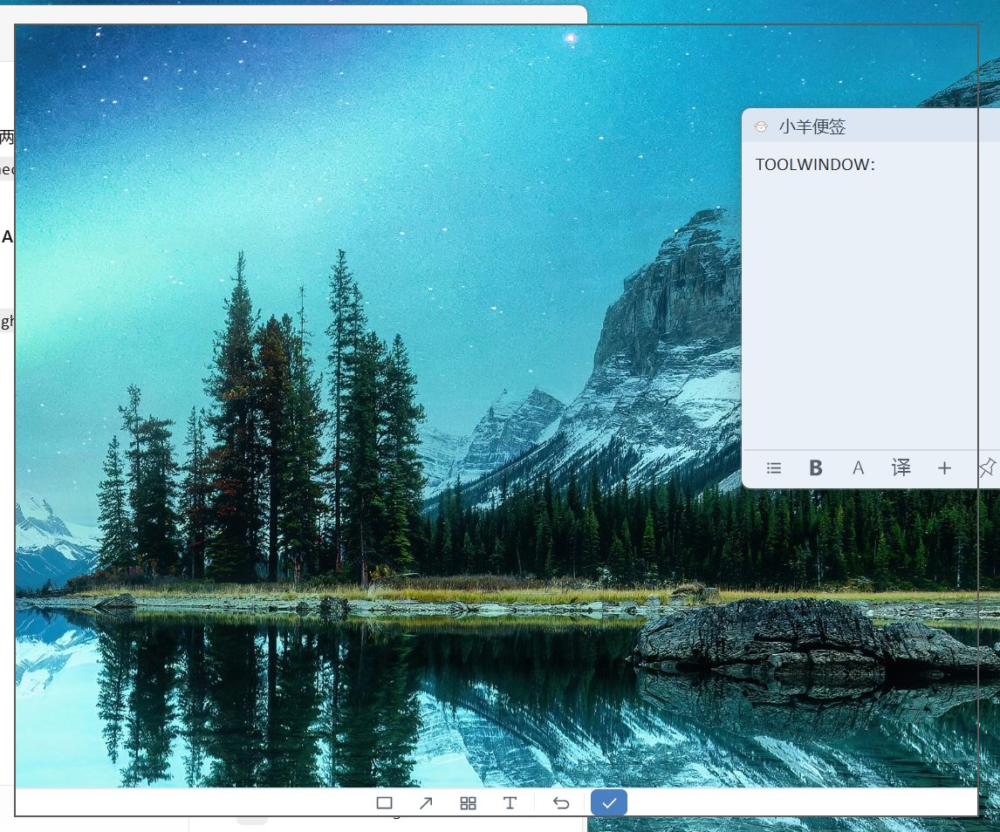
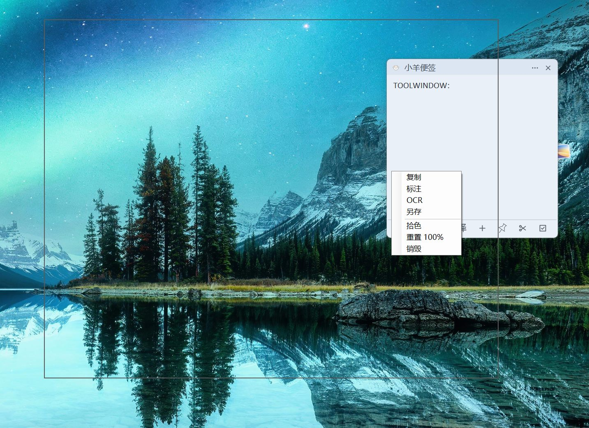

# 小羊便签 KimNotes

Windows 桌面便签 + 截图标注工具。无边框卡片风格，解压即用免安装，全部数据留在本机。

## 下载

**最新版下载**：[KimNotes-v1.1.10.zip](https://github.com/kimlonger/KimNotes/releases/latest)（Windows 10 / 11，需 .NET Framework 4.8，系统一般已自带）。下载后解压到任意目录，双击 `KimNotes.exe` 运行——同目录只有一个第三方依赖 `Newtonsoft.Json.dll`，不能单独拿走 exe。

官网：[https://note.kimlulu.com](https://note.kimlulu.com) ｜ 当前版本：1.1.10 ｜ 许可证：[Apache-2.0](LICENSE)

## 界面一览

| 便签编辑卡 | 便签列表 | 待办清单 | 设置 |
|---|---|---|---|
|  |  |  |  |

第一列那张是便签卡片展开 ⋯ 下拉面板的样子：顶部 8 格是主题色板（✓ 为当前），下面是「待办清单（右侧角标 = 未完成数）/ 便签列表 / 设置」三个入口。

## 功能

### 便签
无边框卡片窗体，边缘可拖拽拉伸，标题栏常驻（小羊图标 + 标题 + ⋯ / ✕），📌 可以把便签固定在桌面。底部工具栏：项目符号、加粗、大小写转换、翻译、新建、固定、截屏、转待办。

- **翻译**：划选正文（或未划选时取首行）点「译」，中文自动翻英文、其他语言自动翻中文。
- **便签列表**：所有便签以主题色卡片列出，本地索引做关键词搜索，命中处高亮。
- **无痕模式**（设置页开关）：开启后不落盘——启动不恢复上次内容、编辑不自动保存、截图双击直接关闭不写文件。

### 截图与标注
全局热键 `Ctrl + 一个键`（默认 `Ctrl + F1`；设置页里 Ctrl 固定，点键帽再按一个键即可换键）。按下后全屏框选，松手即成一张置顶悬浮图。



悬浮窗上滚轮缩放、拖动，右键出菜单：



| 菜单项 | 作用 |
|---|---|
| 复制 | 图片进剪贴板 |
| 标注 | 进入标注模式（见下） |
| OCR | 文字识别，结果**新建一张便签**写入并复制到剪贴板 |
| 另存 | 存到「截图位置」目录 |
| 拾色 | 取屏幕上任意点的颜色，HEX 进剪贴板（窗口里同时给 RGB） |
| 重置 100% | 缩放还原 |
| 销毁 | 关掉这张图 |

标注是四种画笔：矩形 / 箭头 / 马赛克 / 文字，工具条就在截图正下方同一个窗体里（一圈连续边框，不额外浮一个窗）。`Ctrl+Z` 撤销上一笔，`Esc` 或点对勾结束并把标注烘进图片。

### 待办与提醒
待办独立存在 `todos.json`，不污染便签正文。两个入口：便签 ⋯ 面板的「待办清单」，和便签工具栏的「转待办」（有划选就带入选中文字，没划选就空着让你打——**只复制，不动便签原文**）。

清单里一块一张卡片，左侧色条区分状态（待办 / 已过期 / 已完成），按提醒时间排序、过期顶到最前并标红；单击整块 = 完成或恢复，双击 = 改文字。设了时间的到点弹置顶提醒小窗（带铃声 + 轻微抖动）。铃声是一段内嵌在 exe 里的 wav，不走 Windows 声音方案，所以不依赖系统注册表有没有给「警告」事件配图录。

### 主题
8 套配色，便签 / 便签列表 / 待办清单 / 设置 / 提醒窗共用一套视觉，切主题实时应用到所有已开窗口。

> **关于 OCR 和翻译的密钥**：用的是作者自己的百度应用，`utils/Translator.cs`、`utils/RemoteCallUtils.cs` 里是明文 appid/secret。二次开发请换成自己的应用凭证，别蹭额度。

## 技术栈

- C# / .NET Framework 4.8 / WinForms
- 旧式 csproj + `packages.config`（非 SDK-style）
- 第三方依赖只有一个：Newtonsoft.Json 13.0.3

## 编译运行

1. 用 Visual Studio 2019/2022 打开 `KimNotes.sln`（需装 .NET Framework 4.8 目标包）。
2. 首次打开会自动 NuGet restore；`packages/` 不入库。
3. F5 运行，或命令行：

   ```
   msbuild KimNotes.csproj -p:Configuration=Debug
   ```

## 数据存放

全部在 `%AppData%\KimNotes\`：

| 位置 | 用途 |
|---|---|
| `config.txt` | 配置：`shortcutKey` 截图热键、`theme` 主题、`notesPath` / `imagesPath` 存储目录、`checkBox1` 开机启动、`checkBox3` 无痕模式 |
| `notes\` | 便签正文（默认目录，设置页里叫「笔记位置」） |
| `images\` | 截图另存目录（「截图位置」） |
| `index.json` | 便签列表的搜索索引 |
| `todos.json` | 待办清单 |
| `reminders-fired.json` | 提醒去重记录 |

删掉整个目录即回到全新状态。

## 说明

- 窗体与控件尺寸按窗口自身 DPI 量算（`utils/UiDpi.cs`），高分屏下不裁切文字。
- 没有托盘图标：所有窗口关掉即退出进程。

## 社区

项目在 [LINUX DO](https://linux.do) 社区分享、交流并听取反馈，感谢佬友们。

## 许可证

采用 [Apache License 2.0](LICENSE)，可自由使用、修改和再分发，保留版权声明即可。
